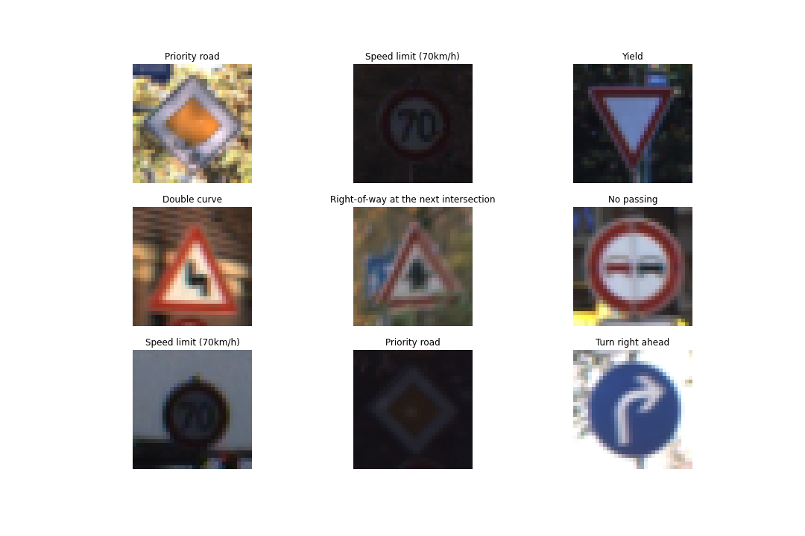
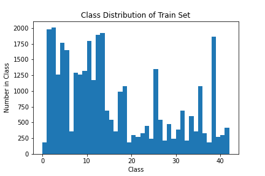
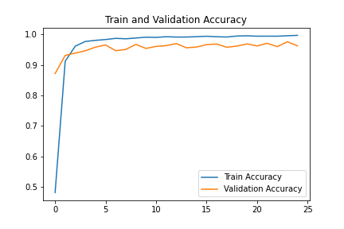
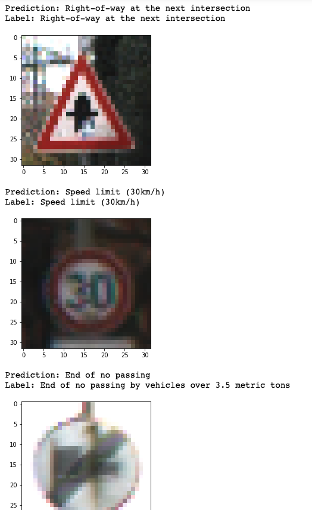
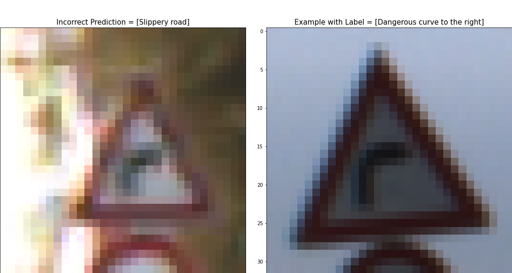

# CNN for Traffic Sign Classification
Using a convolutional neural network to classify traffic signs.

See [Notebook](traffic_sign_classifier.ipynb) for code and further details.

## Dataset
[German Traffic Sign Dataset](https://benchmark.ini.rub.de/?section=gtsrb&subsection=dataset) for the GTSRB benchmark. 

## Exploratory Data Analysis
There are 34799 training images of shape 32x32x3 (RGB) with 43 classes. 
Example images with their class labels:


The train, validation, and test sets have similar class imbalance looking like this: 


## Convolutional Neural Net Architecture
The model architecture is built off of the original [LeNet](http://yann.lecun.com/exdb/lenet/) architecture: 


## Training and Validation
The model was trained for 25 epochs and achieves 96% validation accuracy.




## Testing
The model achieves 95.4% test accuracy. Here are some example predictions:



## Error Analysis
Some error analysis found that the model struggles largely with speed limit signs:

```
Most common misclassifications: 

Prediction = [Speed limit (120km/h)], Label = [Speed limit (100km/h)] happened 52 times
Prediction = [Speed limit (50km/h)], Label = [Speed limit (80km/h)] happened 25 times
Prediction = [Speed limit (60km/h)], Label = [Speed limit (80km/h)] happened 23 times
Prediction = [Speed limit (60km/h)], Label = [Speed limit (50km/h)] happened 21 times
Prediction = [Pedestrians], Label = [General caution] happened 19 times
```

Visualizing most common mistakes:
