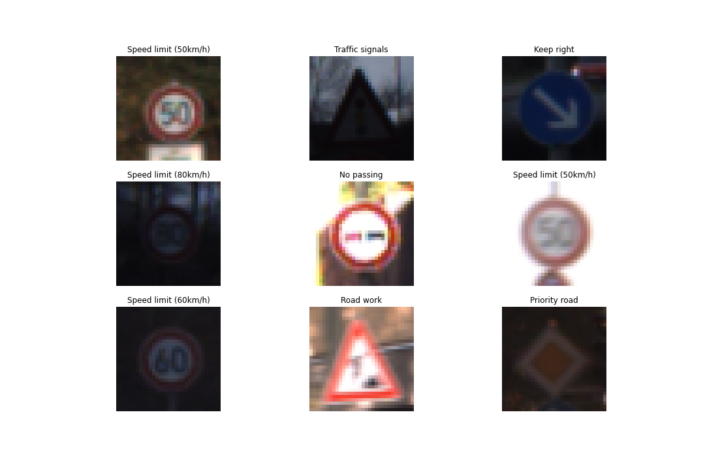

# CNN for Traffic Sign Classification
Using a convolutional neural network to classify traffic signs.

See [Notebook](traffic_sign_classifier.ipynb) for code and further details.

## Dataset
[German Traffic Sign Dataset](https://benchmark.ini.rub.de/?section=gtsrb&subsection=dataset) for the GTSRB benchmark. 

## Exploratory Data Analysis
There are 34799 training images of shape 32x32x3 (RGB) with 43 classes. 
Example images with their class labels:

The train, validation, and test sets have similar class imbalance looking like this: 

## Convolutional Neural Net Architecture
The model architecture is built off of the original [LeNet](http://yann.lecun.com/exdb/lenet/) architecture: 

## Training and Validation
The model trains for 20 epochs and achieves 96% validation accuracy.

## Testing
The model achieves 94.5% test accuracy. Here are some example predictions (note the last one is incorrect, but close):

