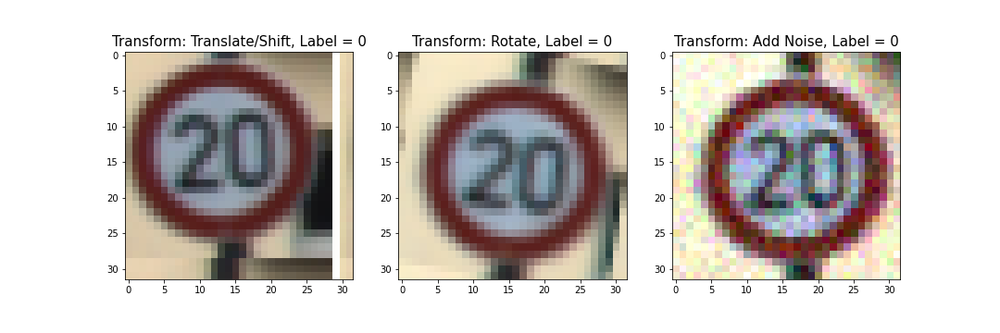
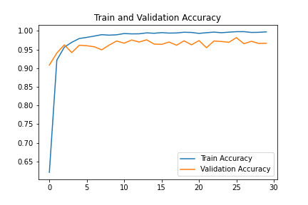
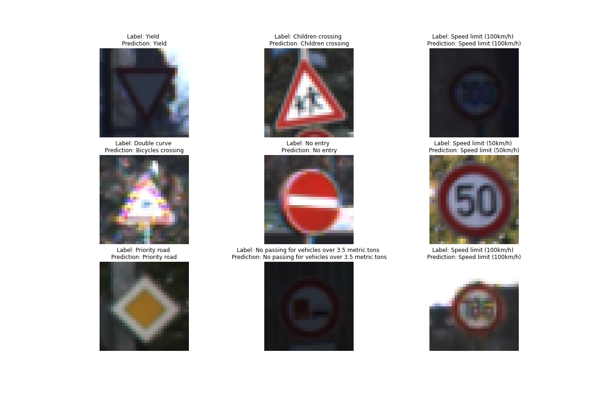

# CNN for Traffic Sign Classification
Using a convolutional neural network to classify traffic signs.

See [Notebook](traffic_sign_classifier.ipynb) for code and further explanation.

## Dataset
[German Traffic Sign Dataset](https://benchmark.ini.rub.de/?section=gtsrb&subsection=dataset) for the GTSRB benchmark. 

## Exploratory Data Analysis
There are 34799 training images of shape 32x32x3 (RGB) with 43 classes `[0, 42]`. 
Example images with their class labels:


The train, validation, and test sets have similar class imbalance looking like this: 


## Data Augmentation & Upsampling
Example of transforms for data augmentation:


I also used data augmentation to help with class imbalance by creating augmented versions of images belonging to underrepresented classes.

## Convolutional Neural Net Architecture
The model architecture is built off of the original [LeNet](http://yann.lecun.com/exdb/lenet/) architecture: 


I altered LeNet-5 by making the network deeper (adding a dense layer) and adding dropout after each dense layer. I also tried removing pooling after the first conv layer in case some information was being lost too quickly. See the `LeNet` class for implementation as well as the `model.summary()` and **Tracking Validation Performance ...** section.

## Training and Validation
The model was trained for 30 epochs on an NVIDIA GTX 1080 GPU, taking roughly 10 minutes and achieved 97% validation accuracy.



Here are some example predictions:



## Error Analysis
Some error analysis found the most common misclassifications of the model in terms of `(incorrect prediction, true label)` pairs:

```
Most common misclassifications: 

Prediction = [End of no passing], Label = [Vehicles over 3.5 metric tons prohibited] happened 26 times
Prediction = [Speed limit (30km/h)], Label = [Speed limit (50km/h)] happened 12 times
Prediction = [Traffic signals], Label = [Road narrows on the right] happened 11 times
Prediction = [General caution], Label = [Pedestrians] happened 10 times
Prediction = [Speed limit (70km/h)], Label = [Speed limit (30km/h)] happened 5 times
```

The first mistake is a bit inexplicable since the signs don't look very similar, other than being circular (see notebook). The speed limit mistakes are unsurprising as numbers can look quite similar, but if MNIST is solvable, a network should not struggle with these variations, especially since the a 7 looks the same on all signs with a 7. Diving more into these errors would be fruitful in determining next steps.

## Test Performance
```
Test Accuracy = 95.7%
```

## Test on Images taken from Web


The model was quite confident of these predictions. The last prediction was of course incorrect. The model predicted 95.7% probability of 20km/h and 4.2% probability of 70km/h, which is of course the correct answer.

## Conclusion
In closing, this was a very fun project. Questions, comments, and tips are welcome!
